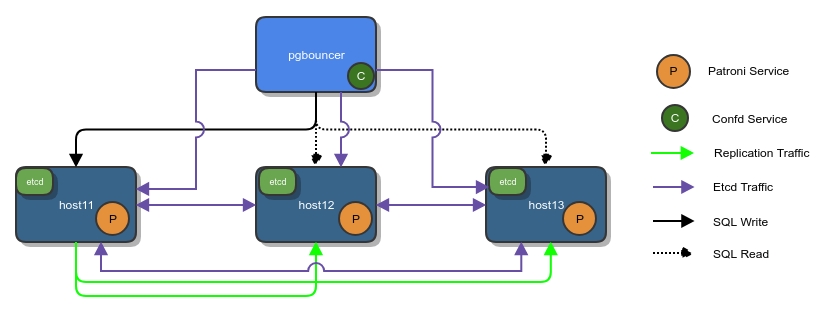

# Postgresql HA Tool: Patroni Auto Deployment in Ansible
This automatic deployment script is for https://github.com/zalando/patroni.
* Following tools are used
    - Vagrant and virtualbox environment
    - Ubuntu 18.04 Bionic Beaver
    - Ansible 2.7.8


* For testing purposes I use 3 vagrant vms on virtualbox. Default vagrant config is used.
* Make 3 copies of vagrant folder and change the ips and hostnames accordingly. ie.

```
host11 10.0.0.11
host12 10.0.0.12
host13 10.0.0.13
```
* Redundant etcd cluster members are on the same patroni/postgres instances.
* Following ansible command automaticaly install
  * postgresql-server, etcd cluster and patroni services on 3 vms,
  * pgbouncer and confd service on the 4th vm.
  * Finishes ready to use, up and running postgres automatic HA cluster.

```
ansible-playbook patroni.yml
```

* Login one of the node, in the command line
```
# list the cluster members
patronictl -c /etc/patroni.yml list

# To list all commands
patronictl -c /etc/patroni.yml
```

* confd setup on another machine can be done [manually](confd) too.
